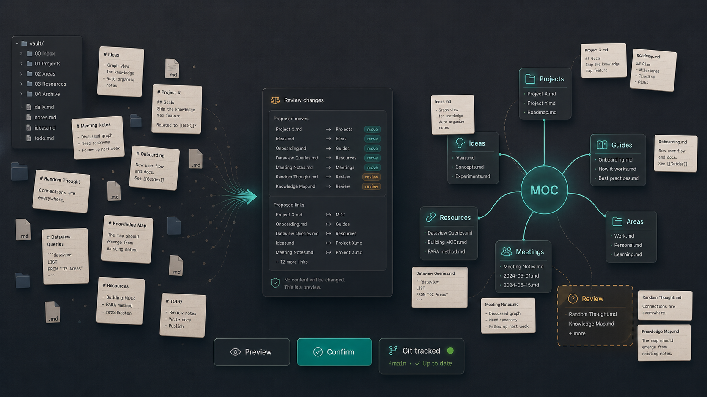

# MapMyVault



A Claude Code skill for turning Markdown/Obsidian vaults into reviewable topic maps with MOC (Map of Content) files.

## What it does

- **Initial setup**: scans note titles, proposes a topic map, moves notes into the matching topic folders, and creates a `MOC.md` in each directory plus a root index
- **Incremental maintenance**: detects new notes via `git status`, proposes where they fit in the existing map, moves them after confirmation, and updates the corresponding `MOC.md`

Note content is never modified — only file locations and MOC files change. All changes are git-tracked.

## Install

### Via OpenClaw

```bash
clawhub install map-my-vault
```

### Via curl (Claude Code)

```bash
mkdir -p ~/.claude/skills/map-my-vault && \
curl -fsSL https://raw.githubusercontent.com/wanli6/MapMyVault/main/skills/map-my-vault/SKILL.md \
  -o ~/.claude/skills/map-my-vault/SKILL.md
```

Restart Claude Code after installing. The skill is available as `/map-my-vault`.

## Usage

Open Claude Code in your vault directory and run:

```
/map-my-vault
```

Or say: "整理一下 vault"、"把新笔记归类"、"初始化 MOC 结构"

Claude will ask for your vault path if needed, show a full preview of every file move and MOC change, and wait for your confirmation before writing anything.

## Requirements

- Claude Code
- Your vault must be a git repository (`git init` if not)

## Uninstall

```bash
rm -rf ~/.claude/skills/map-my-vault
```
